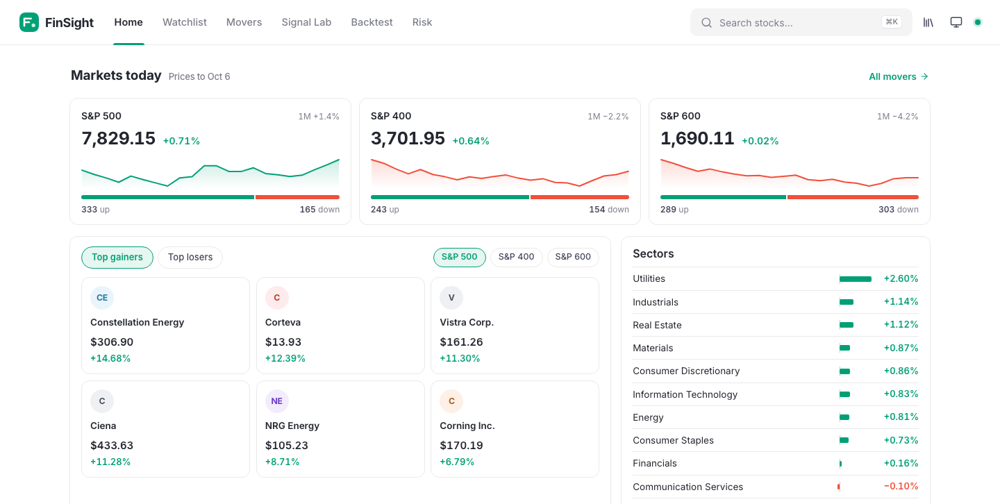
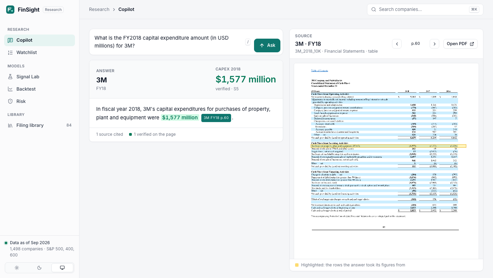
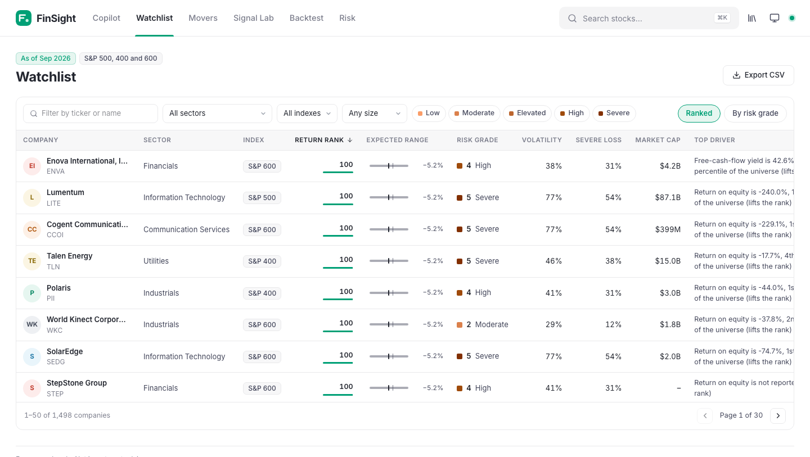
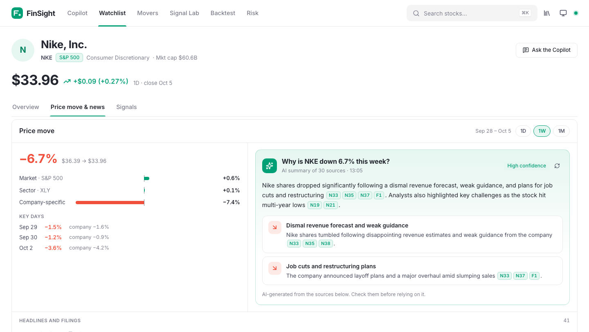
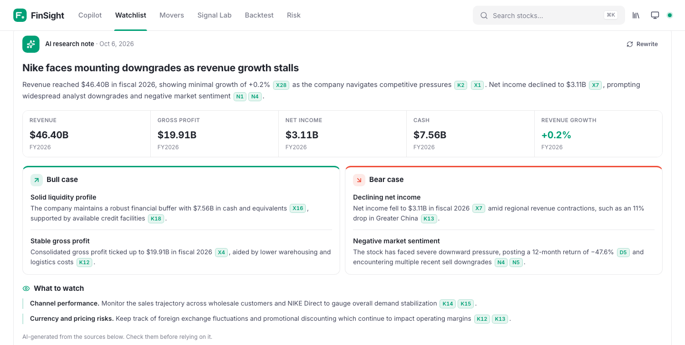
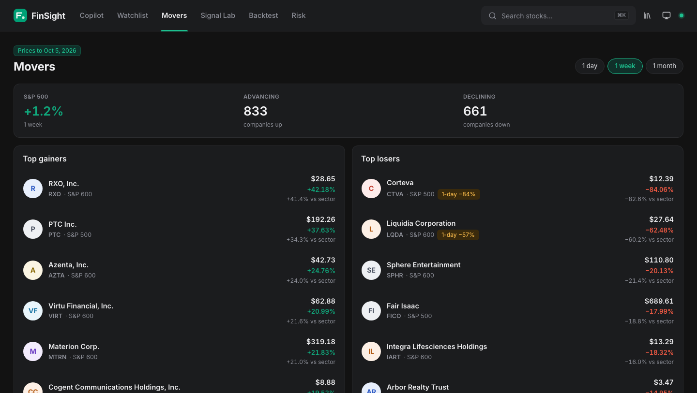
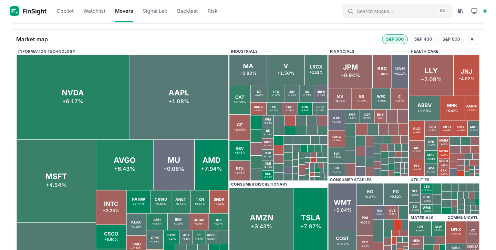

# FinSight

**Filings-driven equity research.** A citation-first copilot that answers questions from SEC filings, and a
point-in-time research platform over about 1,500 US companies: a fundamentals warehouse, 34 signals, a
walk-forward return ranker with a backtest, a risk engine with a 1–5 grade, cited AI research notes, and a web
app that ties them together.

**[Live demo →](https://srikarreddyram.github.io/FinSight/)** (a snapshot: the watchlist, every company page, Movers
with the market map, explanations of the top moves, research notes on well-known companies and the Copilot's
example answers; run it locally for live prices, any company's note and any question).

Everything runs on free tools: the Gemini API free tier (or local Ollama), open-source models for search and
reranking, DuckDB, and public data from SEC EDGAR and Yahoo Finance.



| | |
|---|---|
|  |  |
|  |  |
|  |  |

## Status at a glance

| Module | State | Headline result |
|---|---|---|
| 1. Research Copilot | Built, evaluated | FinanceBench: 81% recall@10, 96% citation precision, 64% answer accuracy on graded questions, 15/15 correct refusals |
| 2. Analyst Agent | First version built | A research note on any company in about 25 seconds: bull case, bear case and what to watch from the latest 10-K, financials, news and FinSight's data; every figure filled in by Python or found in the source it cites |
| 3. Fundamentals warehouse | Built | 45M XBRL facts, 22.7k 10-Ks split into Items, 6.7M daily prices, 758k filing-index rows, all point-in-time |
| 4. Signal Lab | Built | 34 signals; leverage change is the one robust large-cap signal (rank IC 0.045, t = 4.1); price momentum and insider buying add nothing significant |
| 5. Prediction engine | Built, honest null | Walk-forward LightGBM ranker: mean rank IC +0.005 (t 0.2) on test years 2015–2024, and −0.085 on the 2025 holdout; no edge in large, mid or small caps |
| 6. Recommendation layer and web app | Built | Ranked watchlist with SHAP drivers and risk grades; a six-screen web app |
| 7. Risk engine | Built | Severe-loss rate rises from 7% (grade 1) to 47% (grade 5), and from 6% to 51% on the 2025 holdout; matches trailing volatility within a month |
| 8. What's moving a stock | Built | Live moves split into market, sector and company-specific parts; cited drivers from news and 8-Ks in about 3 seconds; Movers screen and market map across the universe |

The models' results are reported as measured, including the ones that didn't work. Phase docs in [`docs/`](docs)
give every number with its baseline.

## Contents

- [The Copilot](#the-copilot)
- [The research platform](#the-research-platform)
- [What's moving a stock](#whats-moving-a-stock)
- [Research notes](#research-notes)
- [The web app](#the-web-app)
- [Getting started](#getting-started)
- [Tech stack](#tech-stack)
- [Repository layout](#repository-layout)
- [Testing and CI](#testing-and-ci)
- [Roadmap](#roadmap)
- [Documentation](#documentation)

## The Copilot

Ask a question about a company's 10-K, 10-Q, 20-F or earnings call. The answer is either correct and cited to a
page you can open, or an honest **"Not found in the filings."** The language model never types a number from a
source and never does arithmetic: it names the figures and calculations it needs, and Python checks each figure
against its cited page and computes the result.

### How an answer is built

```
question
  └─ query parser ── companies, fiscal years ("last year" resolved per company), section hints
       └─ hybrid search ── BM25 (Qdrant sparse) + bge-base dense, filtered, fused with RRF → top 30
            └─ bge-reranker-base cross-encoder → top 8   (tables fed as linearized rows)
                 └─ evidence gate ── best passage too weak? → "Not found in the filings" + closest passages
                      └─ LLM (structured output): figures + quotes, calculation names, prose with
                         {fig:x}/{calc:y} placeholders and [S#] citations
                           └─ Python: verify each figure is printed in its source, compute growth /
                              margins / CAGR, fill placeholders, strip any sentence that is uncited,
                              cites a missing source, or contains a number its source doesn't have
                                └─ answer with [Company FY p.N] citations → source viewer
```

Comparison questions ("Compare Nike's and PepsiCo's gross margin…") fan out into one search per company, and
the answer includes a table.

### Results on FinanceBench

150 questions over 84 filings from 32 companies ([`eval/REPORT.md`](eval/REPORT.md)). Answers by Gemini 3.5
Flash-Lite; graded by Gemma 4 26B, a different model family, so the answering model never grades itself.

| Run | Parsing | Retrieval | Reranker | Filters | Recall@10 |
|---|---|---|---|---|---|
| A: naive baseline | PyPDF, 1,000-token chunks | Dense only | No | No | 41% |
| B | Docling, section and table chunks | Dense only | No | No | 55% |
| C | Docling | Hybrid (BM25 + dense) | No | No | 50% |
| D | Docling | Hybrid | Yes | No | 59% |
| **E: full system** | Docling | Hybrid | Yes | Yes | **81%** |

Full system (run E):

| Metric | Result | Target |
|---|---|---|
| Answer accuracy | 88 correct of 138 graded (63.8%); 58.7% if the 12 the judge couldn't grade count as wrong | ≥ 60% |
| Numeric match (within 1%) | 59% | ≥ 80% |
| Citation precision | 96% | ≥ 90% |
| Correct refusals on 15 unanswerable questions | 15/15 | ≥ 80% |
| Median latency | 13 s | < 10 s |
| Cost | Free tier, 284 LLM calls | |

Most remaining failures are reasoning slips on ratio questions (a formula choice, or which year's balance to
average) and over-refusals where the evidence gate or the figure check was too strict. Card
[#23](https://github.com/srikarreddyram/FinSight/issues/23) tracks them.

### Design notes

- **Tables stay tables.** Docling extracts cells; each table is one chunk holding Markdown for the LLM, a
  one-line summary and the row labels for the dense embedding, and the full table for BM25, so exact figures and
  line-item names match. Large tables split into row groups that repeat the header.
- **Cross-encoders are bad at grids.** bge-reranker-base ranked 3M's cash-flow statement 18th for a capex
  question when fed Markdown; linearized rows ("Purchases of PP&E: 2018 (1,577); 2017 (1,373)") moved it to 11th.
- **One page per text chunk.** Text chunks (~500 tokens, 15% overlap, grouped by section) never cross a page
  boundary, so a citation always names one page.
- **Sections come from 10-K item structure.** Section hints boost retrieval but never filter, because a wrong
  tag would silently drop the right page.
- **Fiscal years.** `fiscal_year` is the year a fiscal year ends in (Infosys FY26 = Apr 2025–Mar 2026), and
  "last year" resolves per company to the latest indexed year.
- **One LLM call per answer.** A single structured call with placeholders gives the same guarantee as separate
  extract, compute and write calls, at about half the latency.
- **EDGAR filings become PDFs.** Filings are HTML without pages, so headless Chrome prints them using their own
  page-break CSS, and page numbers match the filing's pagination.

## The research platform

A point-in-time study of whether information in filings predicts returns and risk. Every figure is used only
from the day after its filing reached the SEC, never from the period it describes.

### Universe

Members of the **S&P 500 since 2010, the S&P 400 since 2016 and the S&P 600 since 2020**: about 500 companies a
month through 2015, 900 from 2016 and 1,500 from 2020, and 2,213 companies in all, including those later removed.

- Membership is rebuilt from each index's published additions and removals, walked backwards from today and
  matched to SEC company IDs rather than tickers (tickers get renamed and reused).
- Each index starts only where its change log is complete; filling earlier years with today's members would
  select the survivors.
- 36 reorganisations under a new SEC ID (Alphabet from Google, Linde from Praxair, Viatris from Mylan) are
  linked to the predecessor company, so the history continues.
- A delisted company is never priced under a ticker someone else now holds.

### Warehouse (Module 3)

DuckDB with append-only, point-in-time tables:

| Table | Rows | What it holds |
|---|---|---|
| `facts` | 45.2M | Every XBRL value from SEC company facts, with its filing date; a restatement is a new row |
| `filing_text` | 22,686 10-Ks | Items 1A, 3, 7, 7A and 9A, including MD&A cut from Exhibit 13 where companies put it there |
| `prices` | 6.7M | Daily total returns and as-traded prices for 1,814 tickers, stored basis-free so splits never create fake moves |
| `filing_index` | 758k | 8-K items, late-filing notices and amendments, for the risk engine's event pillar |
| `universe`, `cik_links` | 2,791 stays | Index membership spans and predecessor links |

### Signals (Module 4)

34 signals in six families: accounting quality (Piotroski F-score, Altman Z, Beneish M, accruals),
fundamentals (growth, margins, returns, leverage, and their changes), valuation (earnings yield, book-to-market,
free-cash-flow yield, sales-to-price), filing text (similarity to last year's Risk Factors and MD&A, Risk
Factors length, MD&A readability), price (12-1 momentum, the past month's return, nearness to the 52-week high)
and insider activity (open-market buying and selling by directors and officers, from Form 4).

Monthly rank IC against the next 12 months' excess return, feature months 2011–2024 (t-statistic on yearly means):

| Signal | S&P 500 | S&P 400 | S&P 600 |
|---|---|---|---|
| Leverage change | **+0.045 (t 4.1)** | +0.017 (t 1.0) | +0.033 (t 1.5) |
| Earnings yield | +0.008 (t 0.2) | +0.053 (t 1.5) | **+0.069 (t 3.3)** |
| Book-to-market | −0.039 (t −0.8) | −0.020 (t −0.4) | +0.088 (t 1.7) |
| Gross margin | +0.032 (t 1.3) | −0.035 (t −0.7) | −0.113 (t −4.9) |
| 12-1 momentum | −0.006 (t −0.2) | −0.008 (t −0.2) | +0.001 (t 0.0) |
| Insider buyers, 6 months | +0.005 (t 0.3) | +0.019 (t 1.0) | +0.018 (t 0.5) |

Cheapness works among small caps and not large ones, the textbook pattern; leverage change works only among large
caps. Momentum, the best-documented pattern outside the filings, is flat here, as it has been in US stocks since
2009, and insider buying is too weak to tell from noise ([`docs/phase-f-price-insider.md`](docs/phase-f-price-insider.md)).
The S&P 600 covers just 2020–2024, and with 204 signal-by-index comparisons several will clear t = 2 by chance, so
these are patterns to test on new data rather than findings.

### Prediction engine (Module 5)

- **Panel:** 194,357 stock-months; audited so that no row uses information dated after its month (0 of 194,051).
- **Validation:** expanding-window walk-forward, one test year per fold (2015–2024), training rows purged where
  their 12-month label overlaps the test year, and all tuning nested inside each fold's training window. 2025 is
  held out for one final run.
- **Ranker:** LightGBM LambdaRank on the signals' monthly ranks, against four baselines (the best single signal,
  ridge regression, F-score alone, random ranks).
- **Backtest:** long the top tenth, short the bottom tenth, monthly, equal-weight, 10 bps per trade.

| | All three indexes | Inside S&P 500 | Inside S&P 400 | Inside S&P 600 |
|---|---|---|---|---|
| Ranker mean rank IC | +0.005 (t 0.2) | +0.018 | +0.011 | −0.002 |
| Long-short return after costs | +4.5% a year (Sharpe 0.42) | +1.7% | +7.0% | +8.8% |

**There is no edge.** The 2025 holdout, scored once at the end, before the price and insider signals were added,
confirms it (ranker IC −0.085; [`docs/holdout-2025.md`](docs/holdout-2025.md)). The whole backtest gain comes from
2020 (+59%); the other nine years compound to −0.3% a year. Removing exposure to size, volatility, momentum and beta
leaves the IC at +0.012 (t 0.6; `models/checks.py`). An early run that showed IC 0.058 inside the S&P 400 did not
survive the full data. The details are in [`docs/phase-d-universe.md`](docs/phase-d-universe.md) and
[`docs/phase-f-price-insider.md`](docs/phase-f-price-insider.md).

### Risk engine (Module 7)

Each company gets a monthly grade from 1 (Low) to 5 (Severe), built from two models (expected volatility, and
the chance of a fall of 40% or more within a year) over five pillars: financial health, earnings quality,
market risk, disclosure risk (10-K text) and event risk (late filings, auditor changes, restatements). Each
model is blended with the stock's trailing volatility at a weight chosen inside each fold, and the grade is
smoothed over three months.

| Grade | Low | Moderate | Elevated | High | Severe |
|---|---|---|---|---|---|
| Fell 40%+ within 12 months | 7.2% | 13.1% | 18.8% | 27.3% | 47.2% |
| Realised volatility | 25% | 30% | 35% | 40% | 64% |

| | Used in grades | Model alone | Trailing volatility alone |
|---|---|---|---|
| Volatility rank IC | 0.777 | 0.766 | 0.779 |
| Downside AUC, within month | 0.787 | 0.767 | 0.791 |
| Downside AUC, pooled | 0.731 | 0.717 | 0.665 |

The grades sort risk cleanly, but within a month they match trailing volatility rather than beat it: the filing
measures add little so far. 9.5% of companies change grade in a month.

### Recommendation layer (Module 6)

Each month the ranker and both risk models are refit on every stock-month with a known outcome and score the
latest month. Every score carries its reasons: the three largest SHAP contributions in plain words ("Return on
equity is 25.0%, 80th percentile of its sector"), the range that stocks with the same rank achieved, and the
realised volatility and severe-loss rate behind each risk grade. The output is a ranked research watchlist; it
never says "buy".

### Known limits

- **Survivorship.** Yahoo keeps no prices for delisted companies, so members later acquired or bankrupt have
  features but no returns: 17% of S&P 400 and 16% of S&P 600 stock-months in the test years, falling to
  single digits by 2024.
- **Short histories** for the smaller indexes (nine test years for the S&P 400, five for the S&P 600).
- **Free data.** Wikipedia's index change logs are volunteer-maintained; about 30 changes stay unresolved.

## What's moving a stock

Pick a company and a window (one day, one week, one month). Live prices are split into the market's part, the
sector's part and the company-specific part, using a regression on the prior year, and the days with the largest
company-specific moves are picked out. Dated headlines (Google News) and the company's 8-K filings (EDGAR) are
gathered around them, and one free-tier Gemini call names the likely drivers; Python keeps only drivers that cite
evidence that was actually given. Nike, week to 5 October 2026: −6.7%, of which −7.4% company-specific, driven by
a weak revenue forecast and job cuts announced with its earnings. The Movers screen runs the same comparison across
all ~1,500 companies. Spin-offs that the price feed doesn't adjust for are flagged rather than reported as losses. The market map shows
every company as a tile sized by market cap and coloured by its move, grouped by sector.
Details in [`docs/phase-e-news.md`](docs/phase-e-news.md).

## Research notes

On any company page, **Write the note** produces a research note in about 25 seconds: a headline, a summary, key
numbers, a bull case, a bear case and what to watch. It is written from the latest 10-K (Item 1A risk headings and
the MD&A passages that best answer four analyst questions), three years of XBRL financials, the past month's news
and 8-Ks, and FinSight's own data (risk grade, the month's move split into market, sector and company parts,
earnings reactions).

The model never types a figure from the financials or FinSight's data: it writes a placeholder and Python fills in
the value and cites it. A figure quoted from a 10-K passage or headline must appear, with the same unit, in the
item the sentence cites, or the sentence is removed; so is any point without a citation. Nike, October 2026: revenue
flat at $46.40B, net income down to $3.11B, Greater China down 11%, a 12-month return of −47.6% and a run of sell
ratings, each linked to its fact, 10-K passage or headline. Details in
[`docs/phase-g-analyst.md`](docs/phase-g-analyst.md).

## The web app

React and TypeScript, served by the same FastAPI backend.

- **Home.** The S&P 500, 400 and 600 with the day's change, a month's sparkline and how many members rose or
  fell; the top gainers and losers in each index; the sectors; why the S&P 500's biggest movers moved, with cited AI
  explanations; the latest research notes; and this month's risk grade changes.
- **Copilot.** At the top of the home page. Ask a question; the answer sits beside the cited filing page, with the
  rows used highlighted, verified figures marked and every citation clickable.
- **Watchlist.** All ~1,500 companies ranked, with risk grade, expected range, volatility, market cap and the
  top driver. Filter by sector, index, size and grade, sort any column, page through, and export the filtered
  rows to CSV.
- **Company pages.** A live quote and a 1M–5Y price chart with earnings days marked; how the stock reacted to
  each earnings report over five years (two-session move against the market, typical size, worst reaction); key
  figures, return and risk drivers, rank and grade history, and each signal's percentile over time.
- **Signal Lab, Backtest and Risk** screens with charts that each have a table view.
- **Research notes.** On each company page: key numbers, bull and bear cards, what to watch, and the sources
  grouped by kind, each 10-K passage expandable to its full text.
- **Movers and price moves.** A market map of the whole universe, and the day's, week's or month's biggest moves
  against each company's sector; on any
  company page, the move split into market, sector and company-specific parts, the key days, the dated headlines
  and 8-K filings, and an Investigate button that returns the likely drivers, each cited.
- **Search (⌘K or Ctrl+K)** for any company or page; light, dark or system theme; a bottom tab bar on phones;
  keyboard accessible throughout. The look follows consumer investing apps: white cards, mint green for gains,
  coral red for losses, pill time ranges.

The app shows the product only; how the numbers are made lives in these docs.

## Getting started

Requirements: Python 3.11 with [uv](https://docs.astral.sh/uv/), Node 20+, and Google Chrome (to print EDGAR
filings to PDF).

```bash
git clone https://github.com/srikarreddyram/FinSight.git && cd FinSight
uv sync --all-extras
cp .env.example .env    # add a free GEMINI_API_KEY (aistudio.google.com) and FINSIGHT_SEC_USER_AGENT with your email
```

SEC requires a User-Agent with a contact email; requests are paced under its 10-per-second limit.

### Copilot

```bash
uv run python -m eval.financebench_loader       # FinanceBench: 150 questions, 84 filings
uv run python -m ingest.parse --all             # Docling, ~2 min per 10-K, cached
uv run python -m ingest.index --all             # embeddings + BM25 into Qdrant (embedded on disk)

uv run python -m ingest.fetch_edgar AAPL MSFT NVDA --years 3     # more filings from EDGAR
uv run python -m eval.run --runs E --sets financebench unanswerable && uv run python -m eval.report
```

### Research platform

Several hours on first run, mostly the 10-K text download; every loader resumes where it stopped.

```bash
uv run python -m warehouse.universe             # S&P 500, 400 and 600 membership
uv run python -m warehouse.xbrl --universe      # XBRL facts
uv run python -m warehouse.sectors
uv run python -m warehouse.prices --universe SPY
uv run python -m warehouse.events
uv run python -m warehouse.tenk --universe --items 1A,3,7,7A,9A
uv run python -m models.study                   # panel and single-signal study
uv run python -m models.ranker && uv run python -m models.backtest
uv run python -m risk.panel && uv run python -m risk.models
uv run python -m models.checks                  # style-neutral ICs and survivorship gaps
uv run python -m recs.build                     # the watchlist and the web app's data
```

`FINSIGHT_THREADS=3` keeps a laptop cool during the builds; `FINSIGHT_UNIVERSE=sp500` runs on large caps only.

### Hosted demo

The demo on GitHub Pages is the same app reading a static snapshot instead of the API (`web/src/demo.ts`).

```bash
uv run uvicorn app.api:app &                    # the snapshot is pulled from a running API
uv run python scripts/build_demo.py             # → web/public/demo (about 40 free-tier LLM calls)
scripts/deploy_demo.sh                          # builds in demo mode and pushes to the gh-pages branch
```

### Web app

```bash
uv run uvicorn app.api:app                      # API on http://localhost:8000 (docs at /docs)
cd web && npm install && npm run dev            # app on http://localhost:5173
```

## Tech stack

| Area | Tools |
|---|---|
| Language models | Gemini 3.5 Flash-Lite (answers) and Gemma 4 26B (query parsing, evaluation judge) on the free tier, throttled per model; Ollama for unlimited local runs; Anthropic optional |
| Retrieval | Docling (tables), fastembed (bge-base, BM25, bge-reranker-base on ONNX), Qdrant |
| Data | SEC EDGAR (submissions, XBRL company facts, filings), Yahoo Finance, Google News RSS, Wikipedia index change logs |
| Storage and modelling | DuckDB, pandas, pyarrow, LightGBM |
| Backend | FastAPI, Pydantic |
| Frontend | React 19, TypeScript, Vite, Tailwind CSS 4, lucide icons, hand-built SVG charts |
| Tooling | uv, ruff, pytest, oxlint, GitHub Actions |

## Repository layout

```
app/        Copilot query path: config, fiscal years, query parser, retrieval, reranking, answers, API
ingest/     fetch filings from EDGAR, parse, chunk, index
eval/       FinanceBench loader, runs, judge, metrics, report
warehouse/  point-in-time store: universe, XBRL facts, prices, 10-K text, events, sectors, fundamentals
signals/    accounting, fundamental, valuation and filing-text signals
models/     panel, walk-forward folds, single-signal study, ranker, backtest, robustness checks
risk/       risk pillars, market measures, panel, models and grades
recs/       latest-month scoring with drivers, and the web app's API
news/       live move breakdown, news and 8-K evidence, cited investigations, the Movers scan
web/        React + TypeScript app
ui/         the original Streamlit prototype
tests/      unit and integration tests
docs/       product requirements and one write-up per phase
data/       manifests only; filings, the warehouse and model outputs are generated locally
```

## Testing and CI

216 Python tests cover parsing on real filing tables, fiscal-year logic, numeric verification, point-in-time
and leakage guarantees (every one checked by breaking it on purpose), index membership reconstruction, signals
with hand-computed values, walk-forward purging, the backtest arithmetic, risk grades, the recommendation API,
the move breakdown and its cited drivers, and the research notes' figure and citation checks.
GitHub Actions runs ruff and the unit tests on every push (the integration tests need downloaded filings).

```bash
uv run pytest -q && uv run ruff check .
cd web && npm run lint && npm run build
```

## Roadmap

Open items on the [project board](https://github.com/srikarreddyram/FinSight/issues):

- Copilot accuracy: over-refusals and ratio formula choices
- Analyst Agent, second half: open-ended questions answered by a planner that sends sub-questions through the
  Copilot; notes that also read 10-Qs and earnings calls
- Price history for delisted and acquired companies, to close the survivorship gap
- Sector-specific risk measures for banks, real estate and energy
- Loughran-McDonald tone signals
- Cross-checking displayed figures against XBRL

## Documentation

| Doc | Covers |
|---|---|
| [`docs/PRD.md`](docs/PRD.md) | Platform requirements: modules, success metrics, bias guardrails, roadmap |
| [`docs/PRD-copilot.md`](docs/PRD-copilot.md) | The Copilot's original spec |
| [`eval/REPORT.md`](eval/REPORT.md) | Copilot evaluation: ablation, metrics, failure analysis |
| [`docs/phase-a-warehouse.md`](docs/phase-a-warehouse.md) | Warehouse, point-in-time rules, universe reconstruction |
| [`docs/phase-b-signals.md`](docs/phase-b-signals.md) | Signals, ranker, backtest, leakage tests, data corrections |
| [`docs/phase-b2-risk.md`](docs/phase-b2-risk.md) | Risk engine: three iterations, targets, baselines |
| [`docs/phase-c-dashboard.md`](docs/phase-c-dashboard.md) | Recommendation layer and web app |
| [`docs/phase-d-universe.md`](docs/phase-d-universe.md) | The S&P 400 and 600 extension and robustness checks |
| [`docs/phase-e-news.md`](docs/phase-e-news.md) | What is moving a stock: move breakdown, news and filings, cited drivers |
| [`docs/holdout-2025.md`](docs/holdout-2025.md) | The 2025 holdout, run once: ranker and risk engine on a year they never saw |
| [`docs/phase-f-price-insider.md`](docs/phase-f-price-insider.md) | Price momentum and insider-buying signals, and the ranker with them |
| [`docs/phase-g-analyst.md`](docs/phase-g-analyst.md) | Research notes: sources, figure checks, API and app |

---

FinSight is a research and education project. Nothing in it is investment advice. Code released under the
[MIT License](LICENSE).
